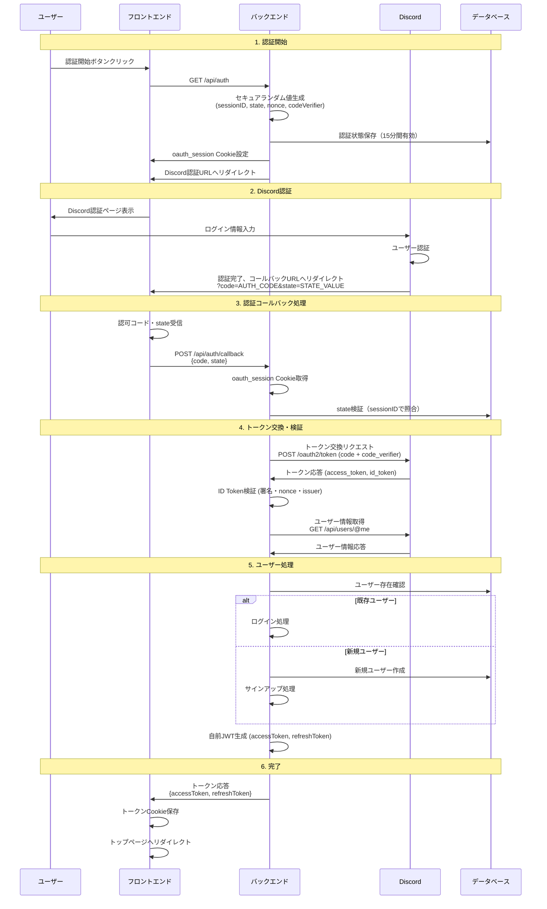

# Discord OIDC認証フロー

## 概要

本プロジェクトでは、Discord OAuth 2.0 + PKCE + OpenID Connectを使用した認証システムを実装しています。

### 認証フロー概要

1. **認証開始**: フロントエンドがバックエンドの`/api/auth`にGETリクエスト
2. **Discord認証**: バックエンドがDiscordの認証ページへリダイレクト（`redirect_uri`はフロントエンドの`/auth/callback/discord`）
3. **認可コード取得**: フロントエンドが認可コードを取得し、バックエンドにPOST
4. **トークン交換**: バックエンドがDiscordからIDトークンを取得して検証
5. **ユーザー処理**: ユーザー情報を取得してログイン・サインアップ処理
6. **完了**: 自前のJWTトークンを返却してフロー終了

このドキュメントでは、認証フローの詳細、セキュリティ対策、実装のポイントについて説明します。

## アーキテクチャ

### 構成要素

- **フロントエンド**: Next.js（React）
- **バックエンド**: Cloudflare Workers（Hono + TypeScript）
- **データベース**: PostgreSQL（Drizzle ORM）
- **認証プロバイダー**: Discord OAuth 2.0

### 主要コンポーネント

```
packages/
├── frontend/
│   └── src/app/auth/callback/discord/
│       ├── page.tsx          # 認証コールバックページ
│       └── page.client.tsx   # クライアントサイド認証処理
└── backend/
    └── src/
        ├── presentation/
        │   ├── controllers/auth.ts      # 認証コントローラー
        │   └── routes/auth.ts           # 認証ルート
        ├── application/
        │   ├── use-case/discord-auth/   # 認証ユースケース
        │   └── services/discord-auth/   # Discord認証サービス
        └── infrastructure/
            └── repositories/            # データアクセス層
```

## 認証フロー詳細

### 全体フロー



### フロー詳細説明

#### 1. 認証開始

- フロントエンドがバックエンドの`/api/auth`にGETリクエスト
- バックエンドは以下のセキュアなランダム値を生成し、認証状態をデータベースに保存：
  - **sessionID** (32文字): セッション識別子（HttpOnly Cookieに保存）
  - **state** (32文字): CSRF攻撃対策用のランダム値
  - **nonce** (32文字): リプレイ攻撃対策用のランダム値
  - **codeVerifier** (64文字): PKCE用のコード検証子
  - **codeChallenge** (SHA256ハッシュ): codeVerifierのハッシュ値
- `oauth_session` Cookieを設定してDiscord認証URLへリダイレクト

#### 2. Discord認証

- バックエンドは`redirect_uri`としてフロントエンドの`/auth/callback/discord`を指定
- ユーザーがDiscordで認証完了後、フロントエンドに認可コードとstateが送信される

#### 3. 認証コールバック処理

- フロントエンドが認可コードとstateを受け取り、バックエンドにPOST
- バックエンドはセッションCookieからsessionIDを取得し、stateを検証

#### 4. トークン交換・検証

- バックエンドがDiscordからアクセストークンとIDトークンを取得
- IDトークンの署名、nonce、issuerを検証
- Discord APIからユーザー情報を取得

#### 5. ユーザー処理

- DiscordのユーザーIDをもとに既存ユーザーか新規ユーザーかを判定
- 既存ユーザー：ログイン処理
- 新規ユーザー：ユーザー作成とサインアップ処理

#### 6. 完了

- 自前のJWTトークン（アクセストークン・リフレッシュトークン）を生成
- フロントエンドにトークンを返却
- フロントエンドがトークンをCookieに保存してトップページへリダイレクト

## セキュリティ対策

### 1. PKCE (Proof Key for Code Exchange)

**目的**: 認可コード横取り攻撃の防止

```typescript
// コード検証子生成（64文字のランダム文字列）
const codeVerifier = generateSecureRandomString(64);

// コードチャレンジ生成（SHA256ハッシュ）
const codeChallenge = await generateCodeChallenge(codeVerifier);
```

**フロー:**

1. 認証開始時に`code_verifier`と`code_challenge`を生成
2. `code_challenge`をDiscordに送信
3. トークン交換時に`code_verifier`を送信して検証

### 2. CSRF攻撃対策

**State パラメータ:**

```typescript
// 32文字のランダムなstate生成
const state = generateSecureRandomString(32);

// Discord認証URLに含める
params.append("state", state);

// コールバック時に検証
await this.oauthFlowService.verifyStateBySessionID(sessionId, state);
```

### 3. リプレイ攻撃対策

**Nonce パラメータ:**

```typescript
// 32文字のランダムなnonce生成
const nonce = generateSecureRandomString(32);

// ID Token検証時に使用
const idTokenPayload = await this.discordTokenService.verifyIdToken(
  c,
  discordToken.id_token,
  nonce
);
```

### 4. セッション管理

**HttpOnly Cookie:**

```typescript
// セッションIDをHttpOnly Cookieで管理
setCookie(c, "oauth_session", sessionID, {
  httpOnly: true,
  secure: true,
  sameSite: "None",
  path: "/",
  maxAge: 900 // 15分
});
```

## API エンドポイント

### 認証開始

```
GET /api/auth
```

**レスポンス:**

- Discord認証URLへのリダイレクト
- `oauth_session` Cookie設定（HttpOnly、15分間有効）

**処理内容:**

1. セキュアなランダム値を生成（sessionID, state, nonce, codeVerifier）
2. 認証状態をデータベースに保存（15分間有効）
3. `oauth_session` Cookieを設定
4. Discord認証URLへリダイレクト

### 認証コールバック

```
POST /api/auth/callback
```

**リクエスト:**

```json
{
  "code": "認可コード",
  "state": "stateパラメータ"
}
```

**レスポンス:**

```json
{
  "accessToken": "JWTアクセストークン",
  "refreshToken": "JWTリフレッシュトークン"
}
```

**処理内容:**

1. リクエストボディから認可コードとstateを取得
2. `oauth_session` CookieからsessionIDを取得
3. データベースでstateを検証（sessionIDで照合）
4. Discordにトークン交換リクエスト（PKCEのcode_verifierを使用）
5. DiscordからアクセストークンとIDトークンを取得
6. IDトークンの署名、nonce、issuerを検証
7. Discord APIからユーザー情報を取得
8. 既存ユーザーか新規ユーザーかを判定
9. ログイン・サインアップ処理を実行
10. 自前のJWTトークンを生成して返却

### トークンリフレッシュ

```
POST /api/auth/refresh
```

**リクエスト:**

```json
{
  "refreshToken": "リフレッシュトークン"
}
```

**レスポンス:**

```json
{
  "accessToken": "新しいJWTアクセストークン",
  "refreshToken": "新しいJWTリフレッシュトークン"
}
```

### 認証状態確認

```
GET /api/auth/is-authorized
Authorization: Bearer <accessToken>
```

**レスポンス:**

- **200 OK**: トークンが有効
- **401 Unauthorized**: トークンが無効または期限切れ

## エラーハンドリング

### 認証エラー

| エラー        | 説明                   | HTTPステータス |
| ------------- | ---------------------- | -------------- |
| `no_code`     | 認可コードが不足       | 400            |
| `no_state`    | stateパラメータが不足  | 400            |
| `no_session`  | セッションCookieが不足 | 400            |
| `auth_failed` | 認証処理失敗           | 500            |

## 参考資料

- [Discord OAuth2 Documentation](https://discord.com/developers/docs/topics/oauth2)
- [OpenID Connect Core](https://openid.net/specs/openid-connect-core-1_0.html)
- [RFC 7636 - PKCE](https://tools.ietf.org/html/rfc7636)
- [OAuth 2.0 Security Best Practices](https://tools.ietf.org/html/draft-ietf-oauth-security-topics)
