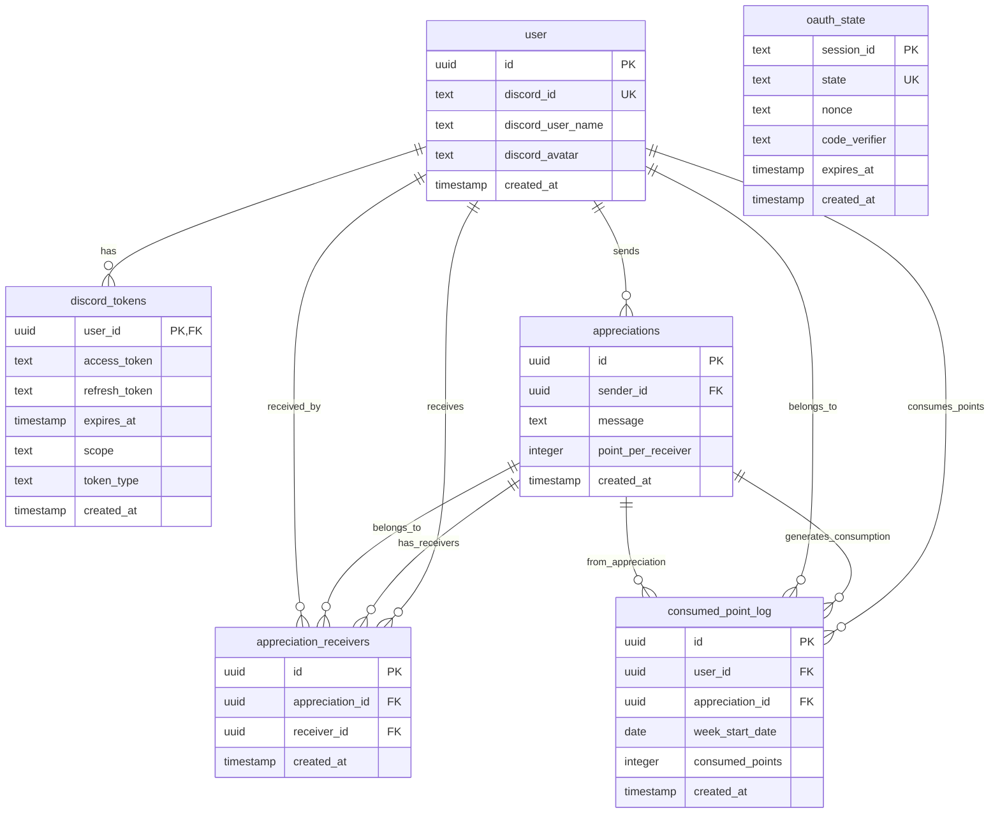
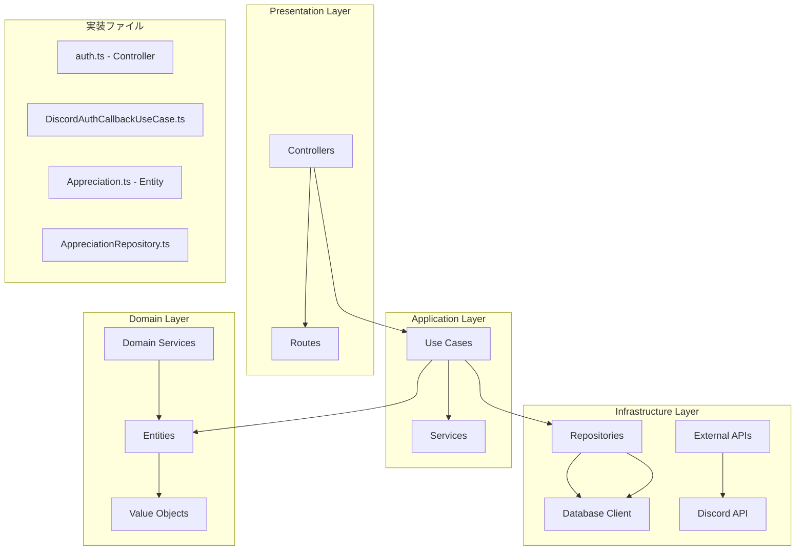
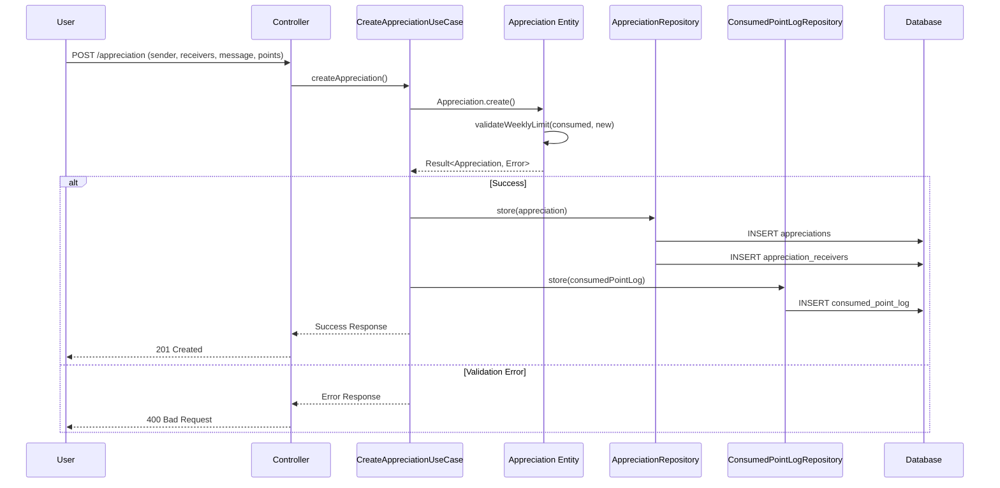
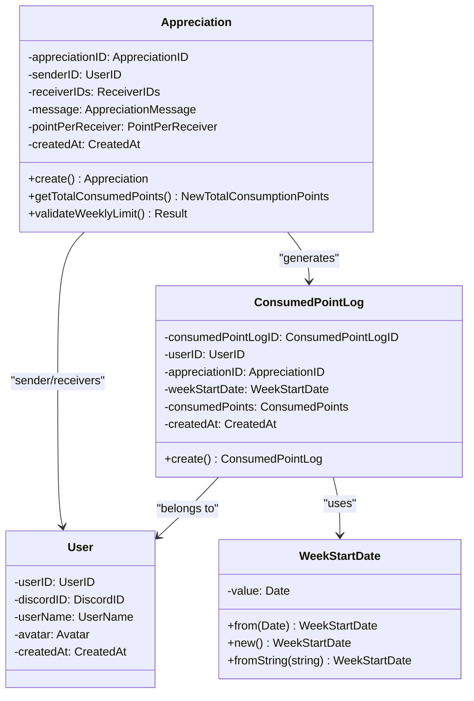
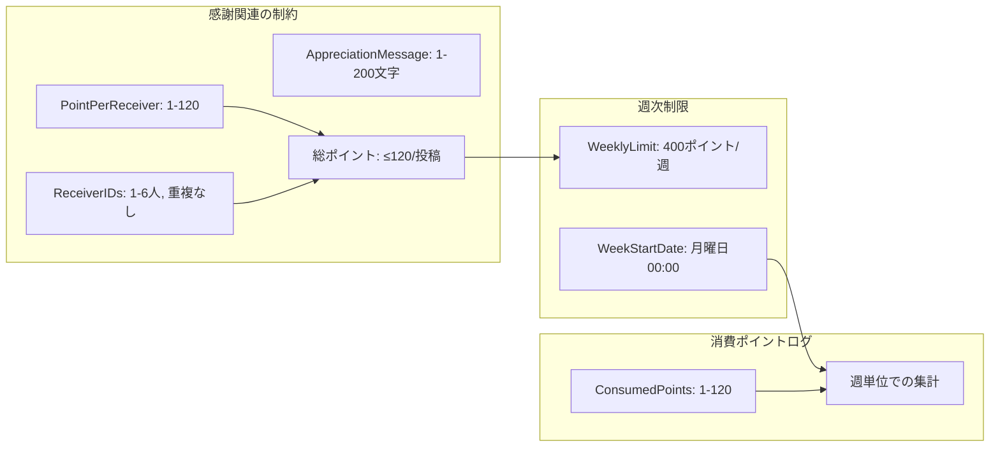

# Unipos システム設計図

## 1. データベーススキーマ（ER図）



## 2. アーキテクチャ構成（レイヤー図）



## 3. 感謝投稿のデータフロー



## 4. 週次ポイント制限チェックのフロー

```mermaid
flowchart TD
    A[感謝投稿要求] --> B[Appreciation.create()]
    B --> C[総消費ポイント計算]
    C --> D[既存消費ポイント取得]
    D --> E{週次制限チェック}
    
    E -->|制限内| F[感謝作成成功]
    E -->|制限超過| G[WeeklyPointLimitExceededError]
    
    F --> H[データベース保存]
    H --> I[感謝テーブル]
    H --> J[受信者テーブル]
    H --> K[消費ポイントログ]
    
    G --> L[エラーレスポンス]

    subgraph "週次制限ロジック"
        M[alreadyConsumed + newConsumption > 400?]
        N[制限値: 400ポイント/週]
        O[週開始日: 月曜日00:00]
    end
```

## 5. ドメインオブジェクトの関係



## 6. 値オブジェクトの制約



## 7. データ変換の流れ

```mermaid
flowchart LR
    subgraph "Domain Layer"
        A[WeekStartDate.value: Date]
    end

    subgraph "Infrastructure Layer"
        B[.toISOString().split('T')[0]]
        C[Database: YYYY-MM-DD]
    end

    subgraph "Reconstruction"
        D[new Date(weekStartDate)]
        E[WeekStartDate.from()]
    end

    A -->|保存時| B
    B --> C
    C -->|取得時| D
    D --> E
    E --> A
```

この設計図は以下の特徴を持っています：

1. **明確な責務分離**: レイヤードアーキテクチャによる関心の分離
2. **ドメイン駆動**: ビジネスロジックがドメイン層に集約
3. **データ整合性**: データベース制約とドメインルールの両方で保証
4. **週次制限管理**: ポイント消費の追跡と制限チェック
5. **型安全**: TypeScriptによる静的型チェック

設計相談時にこの図を提示することで、システムの全体像と課題を明確に伝えることができます。
